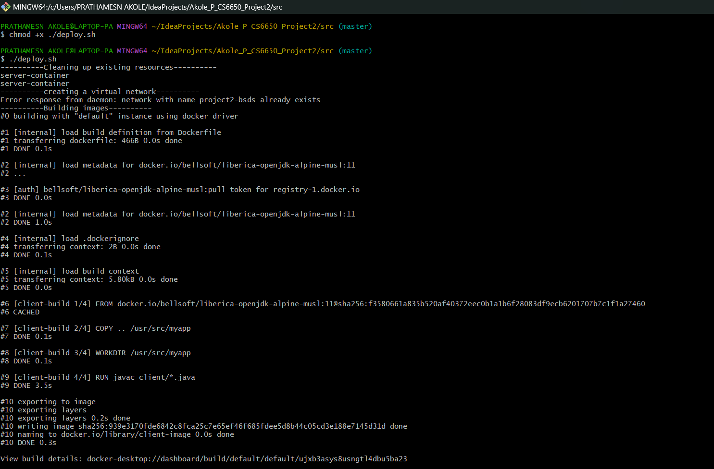
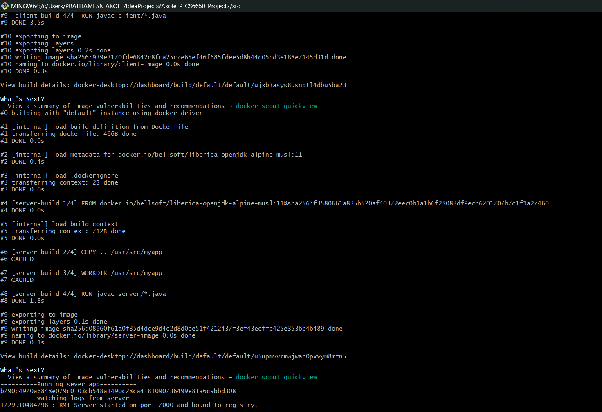
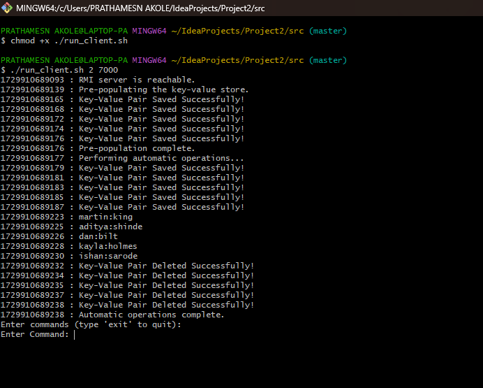

# **Project 2**

**By Prathamesh Akole**

## Steps to follow to run the app with Docker : 

### Step 1
1. Unzip all the files.
2. Open the Dockerfile and insert the `<port_number>` in the last line.
   >`For e.g. CMD ["java", "server.ServerApp", "6000"]`
   
2. Open two tabs of Command Prompt(Mac)/ Git Bash(Windows) .
3. Navigate to the src folder in the terminal in both of them.
4. Run the following command to make shell file executable
   > `chmod +x ./deploy.sh`
4. Run the deploy.sh file by using the command 
   >`./deploy.sh`
6. The server will return a response when it is up and running.

### Step 2

1. In case you have a Windows OS, add `winpty` before the docker run command in the run_client.sh shell file.
   >`winpty docker run -it --rm --name $CLIENT_CONTAINER \ --network $PROJECT_NETWORK $CLIENT_IMAGE \ java client.RMIClientApp $SERVER_CONTAINER "$2"`
2. Open the run_client.sh file. Edit the command according to your OS.

2. Now on the other terminal/bash window run the following command to make shell file executable
   > `chmod +x ./run_client.sh`
2.  run the  ***run_client.sh*** shell file using the command
   >`./run_client.sh <client_id> <port_number>`

   >`E.g. ./run_client.sh 1 6000`
   > 
   > `E.g. ./run_client.sh 2 6000`
2. The ***client_id*** is to allow you to run multiple client on different containers at the same time.
3. You can also open multiple clients at the same time by giving different client_ids

## Steps to follow to run the app without Docker :

### Details

1. The client after the connection is established will pre-populate the data store with 5 key value pairs
2. The client will also perform `5 GET, 5 PUT and 5 DELETE` operations on the key value store.
3. The client will then allow the user to perform operations on the key value store.
4. Type `exit` as the command to exit from the client.
5. To force exit the server press *`Control + C / Command + C`* 

### Miscellaneous Notes

1. The Key and Value are of `String` data type.
2. The `client_log`and `server_log` files contain the logs of client and server respectively.

## Screenshots ### App running on local 

1. **Running Server on Docker(Git Bash - Windows)**

2. **Running Client on Docker(Git Bash - Windows)**

